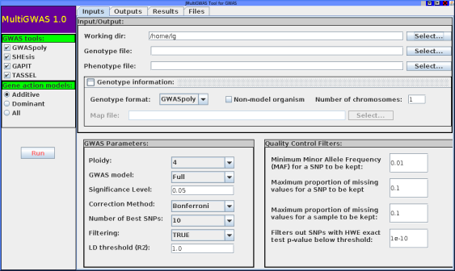

# MultiGWAS
MultiGWAS is a tool that does GWAS for diploid and tetraploid organisms by executing in parallel four GWAS software, two for polyploid data (GWASpoly and SHEsis) and two for diploids data (GAPIT and TASSEL). MultiGWAS has several advantages. It runs either in the command line or in an graphical interface; it manages different genotype formats, including VCF; it allows control for population structure and relatedness, along with several quality control checks on genotype data. Besides, MultiGWAS can test for each GWAS tool all its gene action models, and through a proprietary scoring function, select the best model to report its associations. Finally, it generates several reports that facilitate the identification of false associations from both the significant and the top association SNP among the four software.

Table of Contents
=================
<!--ts-->
   * [MultiGWAS Installation](#multigwas-installation)
      * [Installation from sources](#installation-from-sources)
      * [Installation from precompiled libraries (Ubuntu 20.04, R 3.6)](#installation-from-precompiled-libraries-ubuntu-2004-r-36)
      * [Installation from ready-to-use virtual machine and docker container](#installation-from-ready-to-use-virtual-machine-and-docker-container)
   * [Running MultiGWAS](#running-multigwas)
      * [Observations](#observations)
      * [Using the command line interface (CLI interface):](#using-the-command-line-interface-cli-interface)
      * [Using the graphical user interface (GUI interface):](#using-the-graphical-user-interface-gui-interface)
   * [Running the examples](#running-the-examples)
   * [Configuration file](#configuration-file)
      * [Example of a configuration file](#example-of-a-configuration-file)
      * [Genomic data and formats](#genomic-data-and-formats)
         * ["genotypeFile"](#genotypefile)
         * ["genotypeFormat"](#genotypeformat)
         * ["phenotypeFile"](#phenotypefile)
         * ["mapFile"](#mapfile)
   * [Considerations](#considerations)
      * [Implementation](#implementation)
      * [Number of SNPs in Manhattan and QQ plots](#number-of-snps-in-manhattan-and-qq-plots)
      * [Correction for multiple testing](#correction-for-multiple-testing)
<!--te-->

# MultiGWAS Installation 
MultiGWAS offers different installations: from sources, precompiled versions, and ready-to-use virtual machine and docker image. Specific instructions are given below.

## Installation from sources
To install MultiGWAS from source on a Linux system (tested on Ubuntu 20.04), follow the instructions below: 

```
1. Open a linux console (or terminal)
2. If not installed, install R (R>=3.6), Java, and git
    sudo apt install r-base-core default-jre git
3. Download or clone the MultiGWAS repository 
    git clone https://github.com/agrosavia-bioinfo/multiGWAS.git
4. Change to install directory:
    cd install
5. Run the bash script to install the necessary linux packages (it needs sudo privileges).
    sh install-linux-packages.sh
6. Execute the R script to install the necessary R libraries:
    Rscript install-R-libraries.R
7. Open a new terminal or load the new configuration by typing:
    source ~/.bashrc
8. Test MultiGWAS command line interface by tiping:
    multigwas 
9. Test MultiGWAS command line interface by tiping:
    jmultigwas
```
## Installation from precompiled libraries (Ubuntu 20.04, R 3.6) 
To install MultiGWAS with both precompiled R libraries and Java runtime, follow the instructions at:
[https://github.com/agrosavia-bioinfo/MultiGWASpre](https://github.com/agrosavia-bioinfo/MultiGWASpre).

## Installation from ready-to-use virtual machine and docker container
MultiGWAS can be tested on any platform (Linux, OS X, Windows) by using either a VirtualBox virtual machine or a Docker container. In both, MultiGWAS has been installed with all its dependencies (Linux, R, R libraries, and Java). Both solutions are described at:
[https://github.com/agrosavia-bioinfo/MultiGWAS-vm](https://github.com/agrosavia-bioinfo/MultiGWAS-vm).


# Running MultiGWAS 
MultiGWAS can be run from any directory by calling either command "multigwas" or "jmultigwas". The former to run the command line interface (CLI) developed in R, and the latter to run the graphical user interface (GUI) developed in Java (see below). In both, users have to open a terminal and type the respective command. The CLI command needs an additional configuration file as parameter, while the GUI command open a graphical application to specify ". Detailed instructions are given below.

## Observations
  - MultiGWAS can be run from any directory (known as the working directory). For the CLI interface ("multigwas"), it only needs that the configuration file will be copied or created into the working directory (see below). For the GUI interface, the configuration file will be created interactively an saved into the working directory. In both interfaces, results are saved into the working directory. 
  - Genomic files specified in the configuration file (genotype, phenotype, and map files) can be located in any directory, but if they are not located in the working directory, they have to be specified with the full path where they are located.
  - MultiGWAS does not run from the R interface, althouth it was developed in R, as it integrates four GWAS software (GWASpoly, SHEsis, GAPIT and TASSEL) implemented in different languages. 


## Using the command line interface (CLI interface):
  - Open a Linux console
  - Create a new directory or change to an existing one (working directory, e.g. test)
  - Create a new configuration file or copy an existing one (e.g. test.config, see below)
  - Run the CLI MultiGWAS script followed by the name of the configuration file:
      ```
      multigwas test.config
      ```
  - Open a file browser and view the results saved into the working directory. They include:
     - Full html report (with the same name as the analyzed trait)
     - Original graphics and tables generated by MultiGWAS.
     - Preprocessed tables with the GWAS results from the four GWAS packages
     
## Using the graphical user interface (GUI interface):
   - The GUI application is easy and straighforward. It includes four views:
      - Inputs view:  to create the configuration file and start the execution of MultiGWAS
      - Outputs view: to view the logs/messages from the current execution
      - Results view: to view a preview of the HTML report.
      - Files view:   to explore and open the results, including the original tables, graphics, and the full HTML report.
  - To run the application, open a linux console and execute the command: 
       ```
       jmultiGWAS
       ```
  - The following GUI will be displayed with the input view ready to create the configuration file:

	
  - Set configuration parameters:
    - In the **GWAS tools** panel: Choose the tools to run for the analysis.
    - In the **Gene actions model** panel: Choose the gene action model to run for each GWAS tool.
    - In the **Input/Output** panel: Choose the working directory, the genotype, and phenotype files. 
    - In the **Genotype information** panel: Choose the genotype format and if it does not contain chromosome information, choose the file with this information (map file). Additionally, if the genotype is for a non-model organism, set the number of chromosomes to show in results (see below for detailed information of available genotype formats and mapfile structure).
    - In the **GWAS Parameters** panel: Choose the parameter for GWAS analysis to be applied to the selected GWAS tools (see below) and select whether to apply quality filter to the genomic data or not (see below).
    - In the **Quality Control Filters** panel: Choose the different filters to apply to genomic data and set their values or leave the default values.

  - Run MultiGWAS: After all configuration parameters are specified, clicking the **Run** button will start the MultiGWAS analysis. Messages from the analysis will be shown in the **Outputs** tab, and at the end it will show a link to the report generated by MultiGWAS (an html file). Clicking on this link will open a browser showing the html report.

# Running the examples
The multiGWAS directory contains an ***examples*** directory with several examples, one for each genotype format. For each example there is a subdirectory named as the genotype format, each containing all the needed files to run the example, including: the configuration file, phenotype and genotype files, and the map file with chromosome information and reference/alternate alleles, for genotypes formats that does not include this information (see below).

To run an examples, follow the instructions below:
```
1. Open a terminal and change to the MultiGWAS directory:
   cd multiGWAS
2. Change to ***examples*** directory: 
   cd examples
3. Change to the specific example subdirectoy (e.g. "gwaspoly-format")
   cd gwaspoly-format
4. Run MultiGWAS with the configuration file  (e.g. "configuration-gwaspoly-format-Full-Filters.config")
   multigwas configuration-gwaspoly-format-Full-Filters.config
5. Open the system file manager and browse the MultiGWAS report (html file) saved on the working directory.
```

For each MultiGWAS execution, an output directory will be created named as "out-XXXX" where XXXX is the prefix of the configuration filename. The output directory contains:
  - A file in HTML format with the full report from MultiGWAS results.
  - A "report" subfolder with the resulting tables and graphics included in the previous report file.
  - An "out" subfolder containing temporary files created by MultiGWAS and the other GWAS tools.
  - A "logs" subfolder containing the log outputs from the different tools.
    
# Configuration file
The configuration file is a text file with a list of parameter names and their values separated by a colon (":"). This file is the main input for MultiGWAS and it can be created in three ways: using a general text editor, using the MultiGWAS GUI interface, or modifying an existing configuration file. 

All keywords in the parameter file may be entered in upper and/or lower case; spaces are allowed but not required around the “:” sign. 
Upper / lower case is relevant for the filenames. Blank lines and comment lines (starting with the number sign #) may be added, as well as extra text after the data on a line. The only requirement is that all the data (filenames and other strings) do not contain blanks (spaces, tab characters).

Now, we briefly describe these parametes and then we show an example of a config file.

|  Parameter name     | Description |                     
|------------------   |------------  |                   
| genotypeFile        | Genotype filename, file with the marker data (see genomic data section below) |
| phenotypeFile       | Phenotype filename, file with the individuals and trait values (see genomic data section below) |
| genotypeFormat      | Genotype format, currently four formats: "gwaspoly", "matrix", "vcf", "updog" and "fitpoly" (see genomic data section below) |
| mapFile             | Map file, optional file with marker information (marker, reference allele, alternate, allele, chromosome, and position (see genomic data section below) |
| nonModelOrganism    | TRUE or FALSE if the data is for a non-model organism or not (see below). |
| numberOfChromosomes | Number of chromosomes to show in results when the data is from a non-model organism |
| significanceLevel   | The genome-wide significance threshold α (commonly 0.01 or 0.05)|
| correctionMethod    | The method for multiple testing correction (”Bonferroni” or ”FDR”)|
| geneAction          | Gene-action assumed model (Marker-effect). Currently, four options: "additive", "general", "dominance", or "all" |
| gwasModel           | The type of GWAS analysis (”Naive” or ”Full”)|
| filtering           | TRUE or FALSE whether to use quality control (QC) filters or not (see below) |
| MAF                 | Minor allele frequency QC filter |
| MIND                | Individual missing rate QC filter |
| GENO                | SNP missing rate QC filter |
| HWE                 | Hardy-Weinberg threshold QC filter|
| R2                  | User-defined squared correlation threshold (R²) above which a pair of SNPs is considered to be in linkage disequilibrium |
| tools               | Tools to be used in the analysis. Any combination of the following tools: "GWASpoly", "SHEsis", "GAPIT, and TASSEL
| nBest               | Number of top associations to be reported

## Example of a configuration file
This is the contents of a typical configuration file named as "full-tetra.config":
```
# Files
genotypeFile        : genotype-gwaspoly-format-example.csv
phenotypeFile       : phenotype-tuber_shape-example.csv
genotypeFormat      : gwaspoly
mapFile             : NULL
nonModelOrganism    : FALSE
numberOfChromosomes :

# GWAS model
ploidy              : 4
significanceLevel   : 0.05
correctionMethod    : Bonferroni    
gwasModel           : Full
geneAction          : additive
R2                  : 0.9 

# Quality control
filtering           : TRUE
MAF                 : 0.01
MIND                : 0.1 
GENO                : 0.1 
HWE                 : 1e-10 

# Tools
tools               : GWASpoly SHEsis GAPIT TASSEL
nBest               : 10

```
## Genomic data and formats
The following parameters from configuration file are related with the type of genomic data required by MultiGWAS. Below, we show the characteristics and structure of the input files. Keep in mind that the headeer line must be present in all the file formats we show below.
### "genotypeFile"
It specifies the filename for the genotype data. (see below the accepted genotype formats).

### "genotypeFormat"
Currently, MultiGWAS accepts five genotype formats: "gwaspoly", "matrix", "vcf", "fitpoly", and "updog":
- ***"gwaspoly" format:*** table with comma separated values (.csv). Each row contains the marker id, the chromosome, the position in the chromosome, and the following columns correspond to the marker data for each individual codified in the "ACGT" format (e.g., AATT, CCGG, AAAT, GGCG). An example follows:
```	 
| Marker   | Chrom | Position | ACBrador | ACLPI175395 | ADGPI195204 | AdirondackBlue |
|----------|-------|----------|----------|-------------|-------------|----------------|
| c2_41437 | 0     | 805179   | AAGG     | AAAA        | AAAA        | AAGG           |
| c2_24258 | 0     | 1252430  | GGGG     | GGGG        | GGGG        | AAGG           |
| c2_21332 | 0     | 3499519  | TTCC     | CCCC        | CCCC        | TTCC           |
```

- ***"matrix" format:*** table with comma separated values (.csv). Each ro contains the marker id and the marker data for each individual codified in a numeric format (e.g. 0,1,2,3,4). An example follows:
 
```
| Marker   | ACBrador | ACLPI175395 | ADGPI195204 | AdirondackBlue | 
|----------|----------|-------------|-------------|----------------|
| c2_41437 | 2        | 0           | 0           | 2              |
| c2_24258 | 0        | 0           | 0           | 2              |
| c2_21332 | 2        | 4           | 4           | 2              |
```

- ***"vcf" format:*** Variang Call Format (VCF) with metadata in the first lines followed by a header line. The following lines contain genotype information of the individuals for each position. VCF marker data can be encoded as simple genotype calls (GT format field, e.g. 0/0/1/1 for tetraploids or 0/1 for diploids) or using the NGSEP custom format fields (Tello et al., 2019): ACN, ADP or BSDP. An example follows:

  - Using the GT format key

	```
	##fileformat=VCFv4.2
	[CLIPPED]
	#CHROM   POS     ID  REF ALT QUAL FILTER INFO FORMAT   sample01    sample02 
	   0   805179  c2_41  A   G    .    .     PR  GT:...  0/1/1/0:... 0/1/0/0:...
	   0   1252430 c2_24  G   A    .    .     PR  GT:...  0/1/1/1:... 1/0/0/0:...
	```

  - Using the ACN format key
	```
	##fileformat=VCFv4.2
	[CLIPPED]
	#CHROM POS       ID  REF ALT QUAL FILTER INFO  FORMAT  sample01  sample02
	   0   805179  c2_41  A   G    .    .     PR  ...:ACN  ...:2,2   ...:3,1
	   0   1252430 c2_24  G   A    .    .     PR  ...:ACN  ...:1,3   ...:3,1
	```

- ***"fitpoly" format:*** table with tab separated values (scores file e.g. filePrefix_scores.dat) containing one line per sample for every marker that could be fitted. MultiGWAS uses only two columns from this file: "MarkerName" and "geno", with the name of the marker and the assigned genotype number, respectively. The genotype number is assigned according to the ploidy, for tetraploids from 0 to 4, and for diploids from 0 to 2. An example follows: 
```
| marker | MarkerName | SampleName     | ratio | P0    | P1    | P2    | P3    | P4    | maxgeno | maxP  | geno |
|--------|------------|----------------|-------|-------|-------|-------|-------|-------|---------|-------|------|
| 1      | c1_1       | ACBrador       | 0.932 | 0.821 | 0.407 | 0.879 | 0.537 | 0.158 | 1       | 0.363 | 1    |
| 1      | c1_1       | ACLPI175395    | 0.719 | 0.823 | 0.385 | 0.213 | 0.834 | 0.873 | 0       | 0.189 | 0    |

```

- ***"updog" format:*** table with comma separated values containing one line per sample for every marker that could be fitted. MultiGWAS uses only two columns from this file: "snp" and "geno", with the name of the marker and the assigned genotype number, respectively. The genotype number is assigned according to the ploidy, for tetraploids from 0 to 4, and for diploids from 0 to 2. An example follows: 
```
|     snp     | ind   | ref | size | geno | postmean | maxpostprob | Pr_0 | ... | Pr_4 | logL_0  | ... | logL_4 |
|-------------|-------|-----|------|------|----------|-------------|------| ... |------|---------| ... |--------|
|PotVar0089524|P3PEM05| 113 | 143  | 3    | 2.99     | 0.99        | 0    | ... | 0    | -176.49 | ... | -39    |
|PotVar0089524|P5PEM04| 69  | 69   | 4    | 4        | 1           | 0    | ... | 1    | -172.29 | ... | -0.16  |
```

### "phenotypeFile"
The phenotype file is formatted as a table separated by commas with the names of the variables (columns) in the first line and with two columns. The first one containing the name (or ID) of the individual, and the second the trait value. An example follows:

```
|Name           | tuber_shape |
|---------------|-------------|
|ACBrador       |    3.59     |   
|AdirondackBlue |    4.07     |
|AllBlue        |    4.73     |
|AlpineRusset   |    4.85     |
|Alturas        |    4.46     |
```

### "mapFile"
This file contains the markers information and it is an an *optional* file only needed when the genotype is numeric, as in the case of  "matrix" and "fitpoly" formats. The file contains a table with separated column values (.csv) with the following information for each marker: marker name, reference allele, alternate allele, chromosome, and position in the chromosome. An example follows:
```
| Markers  | Ref | Alt | Chrom | Position |
|----------|-----|-----|-------|----------|
| c2_41437 | A   | G   | 0     | 805179   |
| c2_24258 | G   | A   | 0     | 1252430  |
| c2_21332 | T   | C   | 0     | 3499519  |
| c2_21320 | T   | G   | 0     | 3810687  |
| c2_21318 | C   | T   | 0     | 3810936  |
```


# Considerations
## Implementation
MultiGWAS is implemented in the R language.  However, some scripts that calling the GWAS tools are writing in bash. The version of the four tools are GWASpoly 1.3 (R library), SHEsis 1.0 (binary program), GAPIT 3.0, and TASSEL 5.0 (Java packages). 

## Number of SNPs in Manhattan and QQ plots
The Manhattan and QQ plots for the different GWAS tools show a different number of markers (SNPs). Two reasons explain this pattern. First, the GWASpoly software uses four models for the marker effect (i.e., additive, general, simplex dominance, and duplex dominance). Therefore,  the plots show the SNPs four times, one for each model. Second, MultiGWAS is using scores instead of raw p-values, and scores are the -log10(p) results. So, when p-values are high, the scores have a negative value, and because the y-axes in the plot start in zero, they are not shown.

## Correction for multiple testing
MultiGWAS is using two methods for correction for multiple testing, the Bonferroni correction and adjusting the False Discovery Rate (FDR). MultiGWAS calculates the Bonferroni correction using the number of non-missing genotypes (NMISS) included in the analysis instead of the whole genotypes. Only SHEsis, PLINK, and TASSEL give the NMISS number. In contrast, GWASpoly does no show the NMISS number, but it uses it internally to calculate the corrections.

